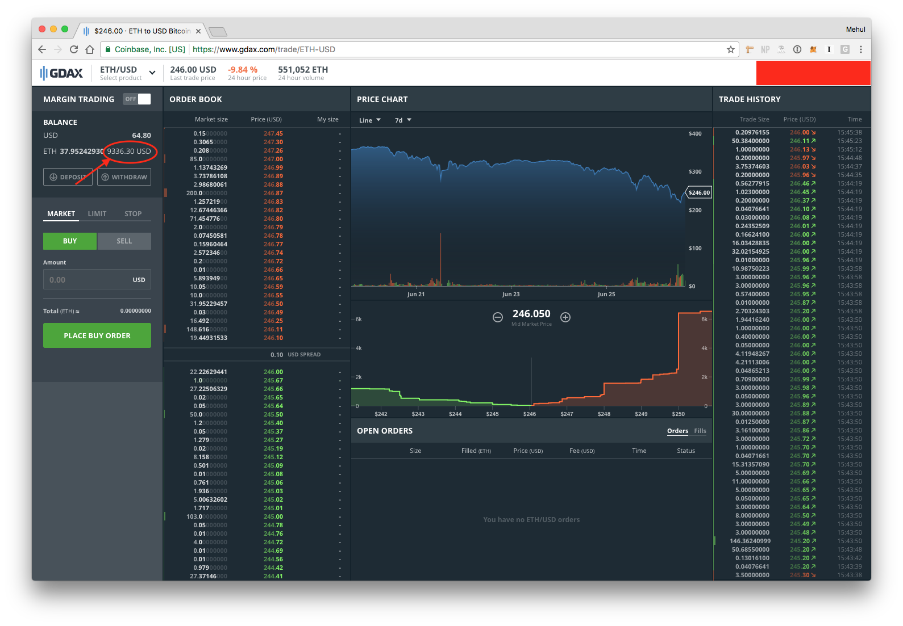

# GDAX Account Value

## Usage

1. Download/clone this repo
1. Open in Finder
1. In Google Chrome, go to `chrome://extensions`
1. Drag/drop the `Source/` directory into Google Chrome
1. Go to https://gdax.com and refresh the page

## Example

## TODO

1. Publish to Chrome store?
